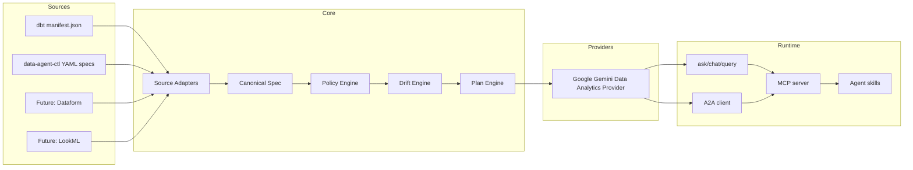
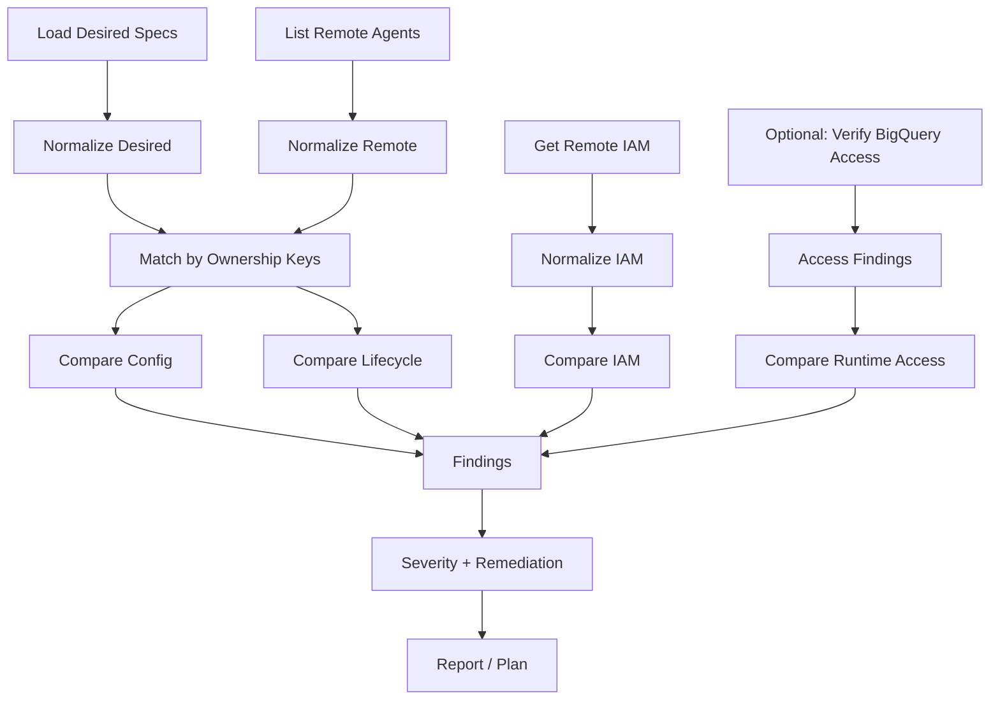

# Executive summary

Build the CLI as a provider-neutral "data agents as code" control plane with Google Gemini Data Analytics as the first provider and dbt Exposures as the first metadata source.

The CLI should solve five jobs:

- Define data agents as code: Parse dbt Exposures, YAML specs, and future metadata sources into a canonical DataAgentSpec.
- Detect drift: Compare desired specs, remote data agents, remote IAM, and optionally runtime service-account access.
- Reconcile lifecycle: Create, update, disable, delete, and import Google data agents.
- Use data agents: Ask, chat, query, and interact with data agents through A2A/runtime APIs.
- Enable coding agents: Ship Claude Code, Cursor, and MCP skills/tools for safe discovery, usage, planning, and review.

The Google Data Analytics API is a good fit for this because it exposes lifecycle methods for data agents, including createSync, updateSync, deleteSync, get, list, listAccessible, plus getIamPolicy and setIamPolicy; it also exposes chat, queryData, conversation APIs, and A2A message endpoints. The service endpoint is `https://geminidataanalytics.googleapis.com`, and Google currently recommends v1beta for production integrations during the Preview period.

Recommended CLI name in this design: `data-agent-ctl`.

---

## Product Design: data-agent-ctl — Data Agents as Code CLI

## 1. Product vision

data-agent-ctl is a CLI, SDK, and agent-tooling layer for managing governed data agents across Google Cloud projects and metadata systems.

It should feel like a hybrid of:

terraform plan/apply
dbt metadata lineage
gcloud resource discovery
kubectl-style inspect/describe
agent runtime client
MCP-compatible coding-agent tool

The product should not be limited to dbt, but dbt should be the first-class integration because dbt Exposures naturally represent downstream analytical applications. dbt Exposures are designed to describe downstream uses of dbt resources, support depends_on, owner, tags, meta, url, maturity, and appear in the dbt DAG.

---

## 1. Goals and non-goals

Goals

1. Manage the full lifecycle of Google Gemini Data Analytics data agents.
2. Detect and manage drift across one or many Google projects.
3. Manage data-agent IAM bindings and access policy.
4. Validate runtime service-account access to underlying BigQuery resources.
5. Support dbt Exposures as a declarative source of truth.
6. Support future sources such as plain YAML, Dataform, LookML, OpenMetadata, or DataHub.
7. Provide runtime commands to use data agents.
8. Provide agent skills for Claude Code, Cursor, MCP clients, and other coding agents.
9. Be safe by default: plan before apply, no destructive changes unless explicit.
10. Work in CI/CD, local development, and platform-engineering workflows.

Non-goals for v1

Non-goal Rationale
Replace dbt dbt remains the transformation and metadata graph system.
Replace Terraform Terraform should still manage stable infrastructure, APIs, service accounts, and dataset IAM.
Build a hosted SaaS control plane Start with CLI + artifacts + CI.
Manage all Google IAM automatically Manage data-agent IAM; validate data-plane IAM.
Support every data catalog on day one Start with dbt and YAML.
Implement a dbt adapter Data agents are not database relations or SQL materializations.

---

## 1. Target users

User Needs
Analytics engineer Define data agents next to dbt Exposures and validate lineage.
Data platform engineer Roll out hundreds of agents safely across projects and environments.
Security / governance engineer Review access policy, drift, IAM changes, and restricted-data exposure.
Data analyst Ask governed agents questions from CLI or notebooks.
Coding agent Discover available agents, ask questions, propose exposure changes, and generate plans safely.
CI/CD system Validate, plan, and apply agent changes after dbt builds.

---

## 1. Core mental model

The CLI reconciles desired state against remote state.

```mermaid
flowchart TD
  A[dbt Exposures] --> B[Source Adapter]
  C[Plain YAML Specs] --> B
  D[Future: Dataform / LookML / Catalogs] --> B
  B --> E[Canonical DataAgentSpec]
  E --> F[Policy Validation]
  F --> G[Desired State]
  H[Google Projects] --> I[Remote Data Agents]
  H --> J[Remote Data-Agent IAM]
  H --> K[Optional BigQuery IAM Checks]
  G --> L[Drift Engine]
  I --> L
  J --> L
  K --> L
  L --> M[Plan]
  M --> N[Apply]
  N --> O[Google Data Analytics API]
```



The key abstraction is a provider-neutral canonical object:

```yaml
apiVersion: data-agent-ctl.dev/v1alpha1
kind: DataAgent
metadata:
  name: sales-operations-agent
  labels:
    managed_by: data-agent-ctl
    source: dbt
    dbt_project: analytics
spec:
  provider:
    type: google-gemini-data-analytics
    project_id: analytics-prod
    location: global
  display_name: Sales Operations Agent
  description: Answers governed sales operations questions.
  instruction: |
    You are a governed sales analytics agent.
    Use only the configured dbt assets.
    Prefer aggregated answers.
    Do not expose customer-level PII.
  sources:
    - type: bigquery_table
      project_id: analytics-prod
      dataset_id: marts_sales
      table_id: fct_orders
    - type: bigquery_table
      project_id: analytics-prod
      dataset_id: marts_sales
      table_id: dim_customer
  runtime_service_account:
    email: `sales-agent-runtime@analytics-prod.iam.gserviceaccount.com`
  access:
    mode: authoritative_bindings
    bindings:
      - role: roles/geminidataanalytics.dataAgentUser
        members:
          - group:sales-ops@example.com
      - role: roles/geminidataanalytics.dataAgentAdmin
        members:
          - group:analytics-eng@example.com
```

---

## 1. High-level architecture



---

## 1. Command surface

Top-level CLI

```text
data-agent-ctl
├── init
├── validate
├── discover
├── list
├── get
├── describe
├── plan
├── apply
├── drift
├── diff
├── import
├── destroy
├── iam
├── ask
├── chat
├── query
├── conversation
├── a2a
├── sources
├── skills
├── mcp
└── doctor
```

Design principles

Principle Explanation
Read-only commands are easy list, get, discover, ask, chat, drift detect.
Mutating commands are explicit apply, destroy, iam set require deliberate invocation.
Plans are first-class artifacts data-agent-ctl plan --out plan.json; data-agent-ctl apply plan.json.
Drift is first-class data-agent-ctl drift detect, data-agent-ctl drift explain, data-agent-ctl drift remediate.
Multi-project is first-class Every lifecycle and drift command supports project lists, folders, and org-scoped discovery.
Coding-agent safe mode MCP and skills expose read/plan by default, not apply/delete.

---

1. Drift management design

### 7.1 What “drift” means

Drift is any difference between desired state and remote state, or between declared policy and effective access.

Drift type Example
Missing remote agent dbt Exposure declares sales-agent, but no remote data agent exists.
Unmanaged remote agent Remote agent exists but has no matching desired spec.
Configuration drift Agent instruction, display name, data sources, labels, or description changed outside the CLI.
IAM drift Remote data-agent IAM differs from desired bindings.
Runtime identity drift Declared service account differs from remote agent config, if supported by API schema.
Data-plane access drift Runtime service account no longer has access to required BigQuery datasets/tables.
Ownership drift Remote labels/annotations no longer identify the dbt exposure or environment.
Policy drift Agent uses forbidden data tags, missing owner, public IAM, or restricted tables.
Orphan drift Remote data agent is still managed by data-agent-ctl, but its source dbt Exposure was removed.
Location/project drift Agent exists in the wrong project or location.

---

### 7.2 Drift commands

```text
data-agent-ctl drift
├── detect
├── explain
├── remediate
├── ignore
├── baseline
├── export
└── report
```

data-agent-ctl drift detect

Detect drift without making changes.

```shell
data-agent-ctl drift detect \
  --source dbt \
  --manifest target/manifest.json \
  --projects analytics-dev,analytics-stg,analytics-prod \
  --location global \
  --format table
```

Multi-project via file:

```shell
data-agent-ctl drift detect \
  --source dbt \
  --manifest target/manifest.json \
  --project-file projects/prod-projects.txt \
  --location global
```

Future org/folder support:

```shell
data-agent-ctl drift detect \
  --folder 1234567890 \
  --project-filter labels.env=prod \
  --location global
```

data-agent-ctl drift explain

Explain one drift finding.

```shell
data-agent-ctl drift explain \
  projects/analytics-prod/locations/global/dataAgents/sales-operations-agent
```

Example output:

```text
Drift: CONFIG_CHANGED
Resource:
  projects/analytics-prod/locations/global/dataAgents/sales-operations-agent
Field:
  spec.instruction
Desired:
  "Use only configured dbt assets. Prefer aggregated answers."
Remote:
  "Use configured dbt assets and raw Salesforce tables."
Risk:
  Remote instruction expands the allowed data surface beyond governed sources.
Suggested remediation:
  data-agent-ctl apply target/data-agent-ctl.plan.json --target sales-operations-agent
```

data-agent-ctl drift remediate

Generate and optionally apply a remediation plan.

```shell
data-agent-ctl drift remediate \
  --source dbt \
  --manifest target/manifest.json \
  --projects analytics-prod \
  --out target/data-agent-ctl-drift-remediation.plan.json
```

Then:

```shell
data-agent-ctl apply target/data-agent-ctl-drift-remediation.plan.json
```

data-agent-ctl drift report

Produce compliance-friendly output.

```shell
data-agent-ctl drift report \
  --source dbt \
  --manifest target/manifest.json \
  --projects analytics-prod \
  --format html \
  --out reports/data-agent-drift.html
```

Formats:

table
json
ndjson
sarif
markdown
html

SARIF is useful for GitHub code scanning / CI annotations.

---

### 7.3 Drift severity model

Severity Meaning Example
critical Security or compliance risk allUsers has data-agent access; restricted table included.
high Data exposure or governance issue IAM changed to include unauthorized group.
medium Functional or ownership issue Service account lacks access to one table.
low Cosmetic or documentation issue Display name differs.
info Unmanaged but not necessarily wrong Remote agent found outside ownership scope.

Example finding:

```json
{
  "id": "drift-20260428-000123",
  "type": "IAM_DRIFT",
  "severity": "high",
  "resource": "projects/analytics-prod/locations/global/dataAgents/sales-operations-agent",
  "field": "access.bindings[roles/geminidataanalytics.dataAgentUser]",
  "desired": ["group:sales-ops@example.com"],
  "remote": ["group:sales-ops@example.com", "user:contractor@example.com"],
  "recommended_action": "remove_member",
  "safe_to_auto_remediate": false
}
```

---

### 7.4 Drift detection algorithm



Matching keys:

1. full resource name
2. project + location + data_agent_id
3. labels:
   - managed_by=data-agent-ctl
   - source=dbt
   - dbt_unique_id=exposure.project.name
   - environment=prod

Canonicalization rules:

Field Canonicalization
Instructions Normalize line endings and trim trailing whitespace.
Labels Sort keys and ignore provider-managed labels.
IAM bindings Sort members; preserve conditions.
BigQuery refs Sort by project/dataset/table.
API output fields Ignore createTime, updateTime, etag, generated names.
Defaults Fill default location, default IAM mode, default delete mode.

---

### 7.5 Drift remediation actions

Drift Default remediation
Missing remote agent Create.
Config changed Update.
IAM changed Apply IAM mode-specific reconciliation.
Service account access missing Fail or emit Terraform suggestion; do not auto-grant by default.
Orphan remote agent Disable by default; delete only with --allow-delete.
Unmanaged remote agent Report only.
Public access found Fail immediately; optional emergency removal command.

---

1. Lifecycle management design

### 8.1 Main lifecycle commands

data-agent-ctl validate

```shell
data-agent-ctl validate \
  --source dbt \
  --manifest target/manifest.json \
  --run-results target/run_results.json \
  --policy policies/data-agent-ctl-prod.yaml
```

data-agent-ctl plan

```shell
data-agent-ctl plan \
  --source dbt \
  --manifest target/manifest.json \
  --run-results target/run_results.json \
  --projects analytics-prod \
  --location global \
  --out target/data-agent-ctl.plan.json
```

data-agent-ctl apply

```shell
data-agent-ctl apply target/data-agent-ctl.plan.json
```

data-agent-ctl destroy

```shell
data-agent-ctl destroy \
  --target sales-operations-agent \
  --project analytics-prod \
  --location global \
  --allow-delete
```

---

### 8.2 Google API mapping

CLI action Google API
List remote agents GET /v1beta/{parent}/dataAgents
List caller-accessible agents GET /v1beta/{parent}/dataAgents:listAccessible
Get one agent GET /v1beta/{name}
Create POST /v1beta/{parent}/dataAgents:createSync
Update PATCH /v1beta/{dataAgent.name}:updateSync
Delete DELETE /v1beta/{name}:deleteSync
Get IAM POST /v1beta/{resource}:getIamPolicy
Set IAM POST /v1beta/{resource}:setIamPolicy
Ask/chat POST /v1beta/{parent}:chat
Natural-language query POST /v1beta/{parent}:queryData
A2A card GET /v1beta/a2a/{tenant=projects/*/locations/*/dataAgents/*}/v1/card
A2A send POST /v1beta/a2a/{tenant=projects/*/locations/*/dataAgents/*}/v1/message:send
A2A stream POST /v1beta/a2a/{tenant=projects/*/locations/*/dataAgents/*}/v1/message:stream

The REST reference lists the v1beta lifecycle, IAM, runtime, and A2A endpoints above.

---

### 8.3 Plan file

Plan files should be immutable, reviewable, and signed/hashable.

```json
{
  "apiVersion": "data-agent-ctl.dev/v1alpha1",
  "kind": "Plan",
  "created_at": "2026-04-28T10:00:00Z",
  "provider": {
    "type": "google-gemini-data-analytics",
    "api_version": "v1beta"
  },
  "source": {
    "type": "dbt",
    "manifest_sha256": "..."
  },
  "actions": [
    {
      "action": "create",
      "resource": "projects/analytics-prod/locations/global/dataAgents/sales-operations-agent",
      "desired": {}
    },
    {
      "action": "set_iam_policy",
      "resource": "projects/analytics-prod/locations/global/dataAgents/sales-operations-agent",
      "mode": "authoritative_bindings",
      "desired_bindings": []
    }
  ],
  "summary": {
    "create": 1,
    "update": 0,
    "delete": 0,
    "iam": 1
  }
}
```

data-agent-ctl apply should verify that:

1. the plan version is supported,
2. the source artifact hash still matches unless --allow-stale-plan,
3. the target project/location match the operator’s flags,
4. destructive actions require explicit flags.

---

1. dbt integration design

### 9.1 dbt Exposures as data-agent declarations

Recommended exposure shape:

```yaml
version: 2
exposures:

- name: sales_operations_agent
    label: Sales Operations Agent
    type: application
    maturity: high
    description: Gemini Data Analytics data agent for sales operations.
    depends_on:
  - ref('fct_orders')
  - ref('dim_customer')
  - source('salesforce', 'opportunities')
    owner:
      name: Analytics Engineering
      email: `analytics-eng@example.com`
    tags:
  - data_agent
  - sales
  - governed
    meta:
      data-agent-ctl:
        enabled: true
        provider: google-gemini-data-analytics
        project_id: analytics-prod
        location: global
        data_agent_id: sales-operations-agent
        instruction: |
          You are a governed sales analytics agent.
          Use only configured dbt assets.
          Prefer aggregated answers.
          If the data cannot answer the question, say so.
        runtime_service_account:
          email: `sales-agent-runtime@analytics-prod.iam.gserviceaccount.com`
        access:
          mode: authoritative_bindings
          bindings:
            - role: roles/geminidataanalytics.dataAgentUser
              members:
                - group:sales-ops@example.com
            - role: roles/geminidataanalytics.dataAgentAdmin
              members:
                - group:analytics-eng@example.com
```

Use meta.data-agent-ctl rather than meta.data_agent so the metadata is owned by the CLI and can support multiple providers later.

---

### 9.2 Artifact parsing

The CLI should parse:

Artifact Purpose
manifest.json Exposures, models, sources, dependencies, descriptions, tags, meta, relation names.
run_results.json Ensure dependencies were successfully built/tested.
catalog.json Optional richer column metadata.
sources.json Optional source freshness validation.

dbt-artifacts-parser is a practical Python dependency because it parses dbt artifacts such as manifest, run-results, catalog, and sources into Python objects.

---

### 9.3 Dependency resolution

dbt node type Handling
Model Resolve to BigQuery table/view relation.
Source Resolve to source relation.
Metric Resolve to semantic dependencies where possible.
Exposure Not supported in v1; fail or warn.
Ephemeral model Expand to physical parents or fail based on policy.
Disabled node Fail.
Failed build/test Fail in prod if require_success=true.

---

1. Multi-project discovery and drift

### 10.1 Project selection

Support all of the following:

```shell
data-agent-ctl list --project analytics-prod
data-agent-ctl list --projects analytics-dev,analytics-stg,analytics-prod
data-agent-ctl list --project-file projects.txt
data-agent-ctl list --folder 1234567890
data-agent-ctl list --organization 9876543210
```

For v1, project-file and explicit projects are sufficient. Folder/org discovery can be implemented later using Cloud Resource Manager APIs.

---

### 10.2 discover

Find all data agents in Google projects.

```shell
data-agent-ctl discover \
  --projects analytics-dev,analytics-stg,analytics-prod \
  --location global \
  --format table
```

Example output:

```text
PROJECT          LOCATION  AGENT_ID                  MANAGED_BY  DRIFT
analytics-prod   global    sales-operations-agent    data-agent-ctl      clean
analytics-prod   global    revenue-exec-agent        data-agent-ctl      drifted
analytics-prod   global    manual-test-agent         unknown     unmanaged
```

---

### 10.3 list versus list-accessible

Two different use cases:

Command API Use
data-agent-ctl list dataAgents.list Inventory for operators with project-level permission.
data-agent-ctl list-accessible dataAgents.listAccessible Runtime discovery for users/coding agents.

Google exposes both list and listAccessible methods for v1beta.projects.locations.dataAgents.

---

1. IAM and access management design

### 11.1 IAM goals

The CLI should manage:

1. Data-agent IAM: who can use/admin the agent.
2. Runtime service account reference: which service account the agent should use, if supported by the API schema.
3. Data-plane access validation: whether the service account can access BigQuery sources.
4. Deployment identity: documented but usually provisioned outside the CLI.

---

### 11.2 IAM modes

```yaml
access:
  mode: authoritative_bindings
  bindings:
    - role: roles/geminidataanalytics.dataAgentUser
      members:
        - group:sales-ops@example.com
```

Mode Behavior Default?
ignore Do not inspect or modify IAM. No
member_additive Add desired members, keep all others. Good for migration
authoritative_bindings Own listed roles, preserve unlisted roles. Yes
authoritative_policy Own entire data-agent IAM policy. Strict environments only

---

### 11.3 IAM drift examples

Unauthorized member

```text
Desired:
  roles/geminidataanalytics.dataAgentUser:
    - group:sales-ops@example.com
Remote:
  roles/geminidataanalytics.dataAgentUser:
    - group:sales-ops@example.com
    - user:external-contractor@gmail.com
Finding:
  type: IAM_EXTRA_MEMBER
  severity: high
```

Missing member

```text
Finding:
  type: IAM_MISSING_MEMBER
  severity: medium
  remediation: add member
```

Public access

```text
Finding:
  type: IAM_PUBLIC_ACCESS
  severity: critical
  member: allUsers
```

Default behavior: fail plan unless policy explicitly allows public access, which it should not in most environments.

---

### 11.4 Data-plane access validation

The CLI should not default to granting BigQuery access, but it should detect missing access.

```shell
data-agent-ctl validate access \
  --source dbt \
  --manifest target/manifest.json \
  --project analytics-prod
```

Output:

```yaml
sales-operations-agent:
  runtime service account:
    `sales-agent-runtime@analytics-prod.iam.gserviceaccount.com`
  missing access:
    - analytics-prod.marts_sales.fct_orders
    - analytics-prod.marts_sales.dim_customer
  suggested Terraform:
    google_bigquery_dataset_iam_member.agent_sales_viewer
```

Optional command:

```shell
data-agent-ctl access suggest-terraform \
  --manifest target/manifest.json \
  --out generated/data_agent_access.tf
```

---

1. Runtime usage design

### 12.1 One-shot ask

```shell
data-agent-ctl ask sales-operations-agent \
  "What were the top drivers of revenue variance last month?" \
  --project analytics-prod \
  --location global \
  --format markdown
```

### 12.2 Interactive chat

```shell
data-agent-ctl chat sales-operations-agent \
  --project analytics-prod \
  --location global
```

### 12.3 Query data

```shell
data-agent-ctl query \
  --project analytics-prod \
  --location global \
  --question "Show revenue by product category for Q1."
```

### 12.4 Conversations

```shell
data-agent-ctl conversation create --agent sales-operations-agent
data-agent-ctl conversation messages conversations/abc123
```

Google’s API supports chat, queryData, conversation creation/listing/deletion, and listing conversation messages.

---

## 1. A2A design

The CLI should expose A2A commands because Google’s API exposes A2A card, send, and stream methods for data agents.

```shell
data-agent-ctl a2a card sales-operations-agent
data-agent-ctl a2a send sales-operations-agent "Summarize revenue anomalies this month."
data-agent-ctl a2a stream sales-operations-agent "Analyze pipeline risk."
```

Use cases:

Command Use
a2a card Let other agents inspect capabilities.
a2a send One-shot task delegation.
a2a stream Long-running streaming agent task.

---

1. Agent skills and coding-agent integration

### 14.1 Repository layout

```text
data-agent-ctl/
├── src/data_agent_ctl/
├── skills/
│   ├── claude-code/
│   │   ├── SKILL.md
│   │   ├── lifecycle.md
│   │   └── runtime.md
│   ├── cursor/
│   │   ├── rules.md
│   │   └── mcp.json
│   ├── codex/
│   │   └── instructions.md
│   └── generic/
│       ├── data-agent-usage.md
│       └── data-agent-lifecycle.md
├── examples/
│   ├── dbt/
│   └── yaml/
└── docs/
```

### 14.2 Skill commands

```shell
data-agent-ctl skills list
data-agent-ctl skills install cursor
data-agent-ctl skills install claude-code
data-agent-ctl skills render generic --out AGENTS.md
data-agent-ctl skills doctor
```

### 14.3 Cursor rules example

```markdown
# Dagent Rules

When the user asks analytics questions:

1. Run `data-agent-ctl list-accessible --format json`.
2. Choose the most relevant data agent.
3. Run `data-agent-ctl ask <agent-id> "<question>" --format markdown`.
4. Do not query raw BigQuery tables directly if a governed data agent exists.
For lifecycle changes:
5. Edit dbt Exposures.
6. Run `dbt parse`.
7. Run `data-agent-ctl validate`.
8. Run `data-agent-ctl plan`.
9. Show the plan before applying.
Never run:

- `data-agent-ctl apply`
- `data-agent-ctl destroy`
- `data-agent-ctl iam set`
unless the user explicitly asks.
```

### 14.4 MCP server mode

```shell
data-agent-ctl mcp serve
```

Default MCP tools:

MCP tool Mutating? Enabled by default
list_data_agents No Yes
get_data_agent No Yes
ask_data_agent No Yes
detect_data_agent_drift No Yes
plan_data_agent_changes No Yes
validate_data_agent_specs No Yes
apply_data_agent_plan Yes No
destroy_data_agent Yes No
set_data_agent_iam Yes No

Enable mutating tools only with:

```shell
data-agent-ctl mcp serve --enable-mutating-tools
```

---

1. Configuration design

### 15.1 data-agent-ctl.yaml

```yaml
version: 1
provider:
  type: google-gemini-data-analytics
  api_version: v1beta
  default_location: global
sources:

- type: dbt
    manifest: target/manifest.json
    run_results: target/run_results.json
ownership:
  managed_by_label: managed_by
  managed_by_value: data-agent-ctl
  environment_label: environment
defaults:
  delete_mode: disable
  iam_mode: authoritative_bindings
  require_successful_dbt_build: true
  require_owner: true
  require_instruction: true
projects:
- analytics-dev
- analytics-stg
- analytics-prod
policy:
  file: policies/data-agent-ctl-prod.yaml
```

### 15.2 Policy file

```yaml
version: 1
restricted:
  deny_tags:
    - pii
    - restricted
    - raw
iam:
  default_mode: authoritative_bindings
  forbidden_members:
    - allUsers
    - allAuthenticatedUsers
  allowed_member_patterns:
    - "^group:.*@example\\.com$"
    - "^user:.*@example\\.com$"
    - "^serviceAccount:.*@.*\\.iam\\.gserviceaccount\\.com$"
drift:
  fail_on:
    - critical
    - high
  ignore_fields:
    - updateTime
    - createTime
    - etag
delete:
  default_mode: disable
  require_allow_delete_flag: true
runtime:
  allow_ask: true
  allow_chat: true
  allow_a2a: true
mcp:
  enable_mutating_tools: false
```

---

1. Source adapters

### 16.1 Interface

```python
class SourceAdapter(Protocol):
    def load_specs(self) -> list[DataAgentSpec]:
        ...

    def validate(self) -> list[Diagnostic]:
        ...
```

### 16.2 Initial adapters

Adapter Command
dbt --source dbt --manifest target/manifest.json
YAML --source yaml --specs data_agents/*.yaml

### 16.3 Future adapters

Adapter Value
Dataform Google-native analytics engineering metadata.
LookML Semantic model and BI domain context.
OpenMetadata Enterprise data catalog integration.
DataHub Enterprise metadata/ownership integration.

---

1. Provider abstraction

### 17.1 Interface

```python
class DataAgentProvider(Protocol):
    def list_agents(self, project_id: str, location: str) -> list[RemoteDataAgent]:
        ...

    def get_agent(self, name: str) -> RemoteDataAgent | None:
        ...

    def create_agent(self, spec: DataAgentSpec) -> RemoteDataAgent:
        ...

    def update_agent(self, spec: DataAgentSpec, update_mask: list[str]) -> RemoteDataAgent:
        ...

    def delete_agent(self, name: str) -> None:
        ...

    def get_iam_policy(self, name: str) -> IamPolicy:
        ...

    def set_iam_policy(self, name: str, policy: IamPolicy) -> IamPolicy:
        ...

    def ask(self, agent: str, question: str) -> AgentResponse:
        ...
```

### 17.2 Google provider

Implementation: GoogleGeminiDataAnalyticsProvider.

Use:

`https://geminidataanalytics.googleapis.com/v1beta`

Google’s REST reference identifies geminidataanalytics.googleapis.com as the Data Analytics API service and lists the discovery document for v1beta.

---

1. Data model

### 18.1 Python core models

```python
from __future__ import annotations
from dataclasses import dataclass, field
from enum import StrEnum
class IamMode(StrEnum):
    IGNORE = "ignore"
    MEMBER_ADDITIVE = "member_additive"
    AUTHORITATIVE_BINDINGS = "authoritative_bindings"
    AUTHORITATIVE_POLICY = "authoritative_policy"
class DriftSeverity(StrEnum):
    INFO = "info"
    LOW = "low"
    MEDIUM = "medium"
    HIGH = "high"
    CRITICAL = "critical"
@dataclass(frozen=True)
class BigQueryTableSource:
    project_id: str
    dataset_id: str
    table_id: str
@dataclass(frozen=True)
class IamBinding:
    role: str
    members: tuple[str, ...]
    condition: dict | None = None
@dataclass(frozen=True)
class AccessPolicy:
    mode: IamMode
    bindings: tuple[IamBinding, ...]
@dataclass(frozen=True)
class RuntimeServiceAccount:
    email: str
@dataclass(frozen=True)
class DataAgentSpec:
    name: str
    provider: str
    project_id: str
    location: str
    data_agent_id: str
    display_name: str
    description: str
    instruction: str
    sources: tuple[BigQueryTableSource, ...]
    runtime_service_account: RuntimeServiceAccount | None
    access: AccessPolicy
    labels: dict[str, str] = field(default_factory=dict)
    source_ref: dict[str, str] = field(default_factory=dict)
@dataclass(frozen=True)
class DriftFinding:
    type: str
    severity: DriftSeverity
    resource: str
    field: str | None
    desired: object | None
    remote: object | None
    message: str
    recommended_action: str
    safe_to_auto_remediate: bool
```

---

1. Safety and governance

### 19.1 Mutability levels

Level Commands
Read-only list, get, describe, ask, chat, drift detect, plan
Low-risk mutation apply create/update without IAM/delete
Medium-risk mutation IAM binding reconciliation
High-risk mutation Delete, authoritative policy, public exposure cleanup
Emergency mutation Remove forbidden IAM members

### 19.2 Safety defaults

Behavior Default
Delete orphaned agents Disable, not delete
Mutating MCP tools Disabled
IAM mode authoritative_bindings
Public IAM members Forbidden
External-domain users Forbidden unless allowed by policy
Apply stale plan Forbidden
Apply without plan in CI Forbidden
Service-account creation Disabled
BigQuery IAM auto-grant Disabled

---

1. CI/CD workflows

### 20.1 Pull request validation

```shell
dbt parse
data-agent-ctl validate --source dbt --manifest target/manifest.json
data-agent-ctl plan \
  --source dbt \
  --manifest target/manifest.json \
  --projects analytics-dev \
  --out target/data-agent-ctl.plan.json
data-agent-ctl drift detect \
  --source dbt \
  --manifest target/manifest.json \
  --projects analytics-dev \
  --format sarif \
  --out target/data-agent-ctl-drift.sarif
```

### 20.2 Production deployment

```shell
dbt build
data-agent-ctl validate --source dbt --manifest target/manifest.json --run-results target/run_results.json
data-agent-ctl plan --source dbt --manifest target/manifest.json --run-results target/run_results.json --projects analytics-prod --out target/data-agent-ctl.plan.json
data-agent-ctl apply target/data-agent-ctl.plan.json
data-agent-ctl drift detect --source dbt --manifest target/manifest.json --projects analytics-prod --fail-on high
```

---

1. Observability

### 21.1 Logs

Support structured logs:

```shell
data-agent-ctl apply target/data-agent-ctl.plan.json --log-format json
```

Example:

```json
{
  "event": "data_agent.updated",
  "resource": "projects/analytics-prod/locations/global/dataAgents/sales-operations-agent",
  "duration_ms": 1820,
  "status": "success"
}
```

### 21.2 Metrics

Optional OpenTelemetry metrics:

Metric Meaning
data-agent-ctl_agents_desired Number of desired agents.
data-agent-ctl_agents_remote Number of remote agents.
data-agent-ctl_drift_findings Count by severity/type.
data-agent-ctl_apply_actions Count by action.
data-agent-ctl_api_errors Count by API method/status.
data-agent-ctl_iam_drift Count of IAM drift findings.

### 21.3 Reports

```shell
data-agent-ctl drift report --format html --out reports/data-agent-ctl.html
data-agent-ctl inventory export --format csv --out reports/data-agents.csv
```

---

## 1. Error handling and exit codes

Exit code Meaning
0 Success, no drift or only allowed findings.
1 Generic failure.
2 Validation failed.
3 Drift detected above threshold.
4 Plan contains forbidden action.
5 Authentication/authorization failure.
6 API error.
7 Stale plan.
8 Partial apply failure.

---

## 1. Repository structure

```text
data-agent-ctl/
├── pyproject.toml
├── README.md
├── docs/
│   ├── product-design.md
│   ├── dbt-exposures.md
│   ├── drift.md
│   ├── iam.md
│   ├── mcp.md
│   └── skills.md
├── src/
│   └── data-agent-ctl/
│       ├── cli.py
│       ├── config.py
│       ├── models.py
│       ├── diagnostics.py
│       ├── canonicalize.py
│       ├── drift/
│       │   ├── engine.py
│       │   ├── findings.py
│       │   └── remediate.py
│       ├── plan/
│       │   ├── engine.py
│       │   ├── apply.py
│       │   └── schema.py
│       ├── policy/
│       │   ├── engine.py
│       │   └── schema.py
│       ├── providers/
│       │   ├── base.py
│       │   └── google_gemini_data_analytics.py
│       ├── sources/
│       │   ├── base.py
│       │   ├── dbt.py
│       │   └── yaml.py
│       ├── iam/
│       │   ├── reconcile.py
│       │   └── validate.py
│       ├── runtime/
│       │   ├── ask.py
│       │   ├── chat.py
│       │   ├── conversations.py
│       │   └── a2a.py
│       ├── mcp/
│       │   └── server.py
│       └── skills/
│           ├── installer.py
│           └── templates/
├── skills/
│   ├── cursor/
│   ├── claude-code/
│   ├── codex/
│   └── generic/
├── examples/
│   ├── dbt/
│   └── yaml/
└── tests/
```

---

## 1. Implementation roadmap

Phase 0 — Spike

Deliverable Description
Google API client List/get/create/update/delete data agents.
Minimal YAML spec Create one agent from local YAML.
data-agent-ctl ask Ask a saved agent a question.
data-agent-ctl list List project agents.

Phase 1 — MVP lifecycle

Deliverable Description
dbt source adapter Parse Exposures from manifest.json.
validate Validate exposure metadata and dependencies.
plan Generate create/update/disable plan.
apply Apply create/update plan.
IAM read iam get.
Skills Install Cursor and Claude Code instructions.

Phase 2 — Drift management

Deliverable Description
drift detect Config + IAM drift.
drift explain Explain individual findings.
drift report Markdown/JSON/SARIF/HTML reports.
drift remediate Generate remediation plan.
Multi-project support Explicit project list and project file.

Phase 3 — Governance

Deliverable Description
Policy engine Deny tags, IAM allowlist, delete rules.
IAM reconciliation authoritative_bindings.
Service-account validation Verify runtime service account access.
Terraform suggestions Generate missing BigQuery IAM snippets.

Phase 4 — Agent-native runtime

Deliverable Description
chat Interactive chat.
conversation Persisted conversation commands.
a2a Card/send/stream commands.
mcp serve Read-only MCP server.
Mutating MCP tools Optional, disabled by default.

Phase 5 — Ecosystem

Deliverable Description
Dataform adapter Source specs from Dataform metadata.
Import Generate dbt Exposure from remote agent.
Drift dashboard Static HTML / JSON reports.
Provider plugin system External provider/source packages.

---

## 1. Key design decisions

Decision Choice Reason
First provider Google Gemini Data Analytics The API supports lifecycle, IAM, runtime, and A2A.
First source dbt Exposures Best semantic fit for downstream agent applications.
Core spec Provider-neutral DataAgentSpec Avoid dbt/Google lock-in.
Drift First-class subcommand Required for managing hundreds of agents.
IAM default authoritative_bindings Safer than full policy ownership, stronger than additive-only.
Delete default Disable, not delete Prevent accidental destructive changes.
Runtime support ask, chat, a2a Makes the CLI useful beyond deployment.
Coding-agent support Skills + MCP Supports Claude Code, Cursor, and future tools.
Language Python first Strong dbt artifact ecosystem and Google auth libraries.

---

## 1. Open questions

Question Proposed answer
Should the CLI create service accounts? No by default; Terraform should manage them. Optional dev-only --allow-service-account-create.
Should the CLI auto-grant BigQuery access? No by default; validate and suggest Terraform.
Should drift remediation auto-apply? No; generate plan first.
Should unmanaged remote agents be imported or ignored? Report as unmanaged; offer data-agent-ctl import.
Should data-agent-ctl ask require source metadata? No; runtime usage should work with remote agent ID alone.
Should mutating MCP tools exist? Yes, but disabled by default.
Should conversations be managed as lifecycle resources? No; treat as runtime state.

---

## 1. Example end-to-end workflow

```shell
# 1. Build dbt project

dbt build

# 2. Validate data-agent exposures

data-agent-ctl validate \
  --source dbt \
  --manifest target/manifest.json \
  --run-results target/run_results.json \
  --policy policies/data-agent-ctl-prod.yaml

# 3. Detect drift across projects

data-agent-ctl drift detect \
  --source dbt \
  --manifest target/manifest.json \
  --projects analytics-dev,analytics-stg,analytics-prod \
  --location global \
  --format markdown

# 4. Generate deployment plan

data-agent-ctl plan \
  --source dbt \
  --manifest target/manifest.json \
  --run-results target/run_results.json \
  --projects analytics-prod \
  --out target/data-agent-ctl.plan.json

# 5. Apply reviewed plan

data-agent-ctl apply target/data-agent-ctl.plan.json

# 6. Ask an agent a question

data-agent-ctl ask sales-operations-agent \
  "What changed in sales pipeline risk this week?" \
  --project analytics-prod \
  --location global \
  --format markdown

# 7. Install coding-agent instructions

data-agent-ctl skills install cursor
data-agent-ctl skills install claude-code
```

---

Final recommendation

Build data-agent-ctl as a generic data-agent lifecycle and runtime CLI with these first-class capabilities:

```text
data-agent-ctl validate
data-agent-ctl plan
data-agent-ctl apply
data-agent-ctl drift detect
data-agent-ctl drift explain
data-agent-ctl drift remediate
data-agent-ctl list
data-agent-ctl list-accessible
data-agent-ctl get
data-agent-ctl iam get/set
data-agent-ctl ask
data-agent-ctl chat
data-agent-ctl a2a card/send/stream
data-agent-ctl skills install
data-agent-ctl mcp serve
```

The differentiator should be drift management across Google projects plus agent-friendly runtime usage. That combination makes the tool valuable for platform teams, analytics engineers, governance teams, and coding agents.

Three immediate next actions: define the canonical DataAgentSpec and drift-finding schemas, implement data-agent-ctl drift detect for config/IAM drift against one project, then add dbt Exposure parsing to generate desired specs from manifest.json.
